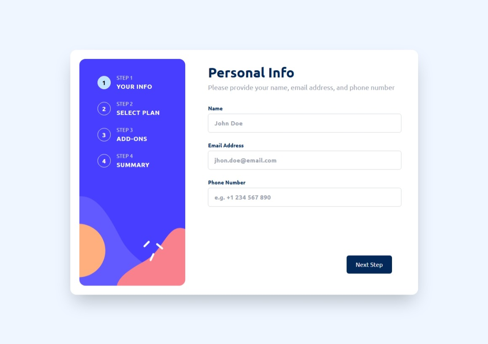
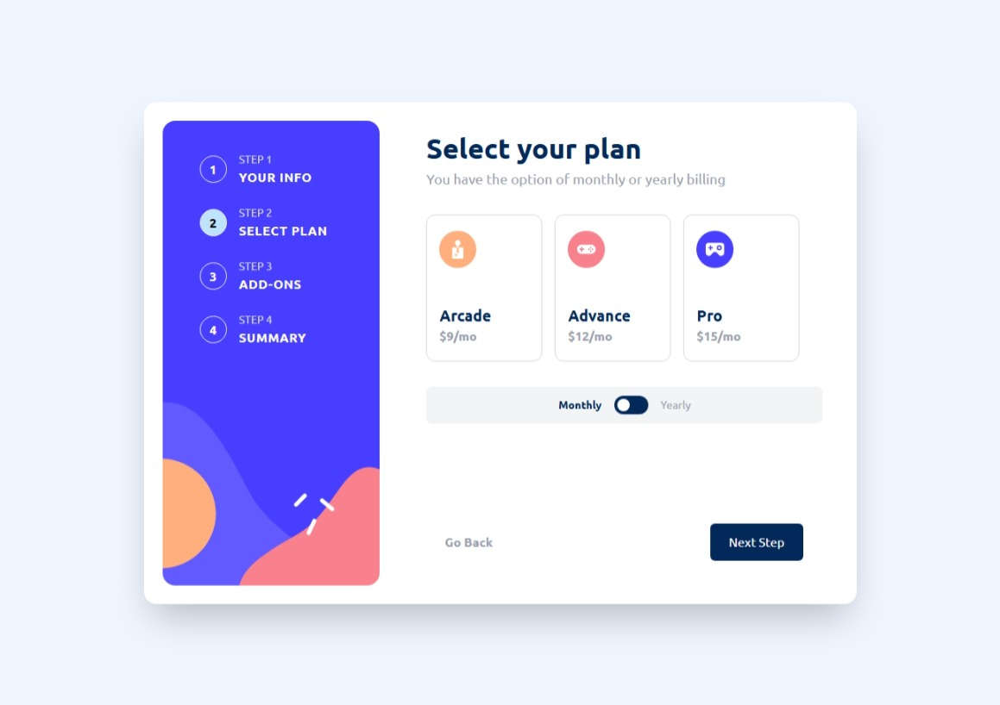
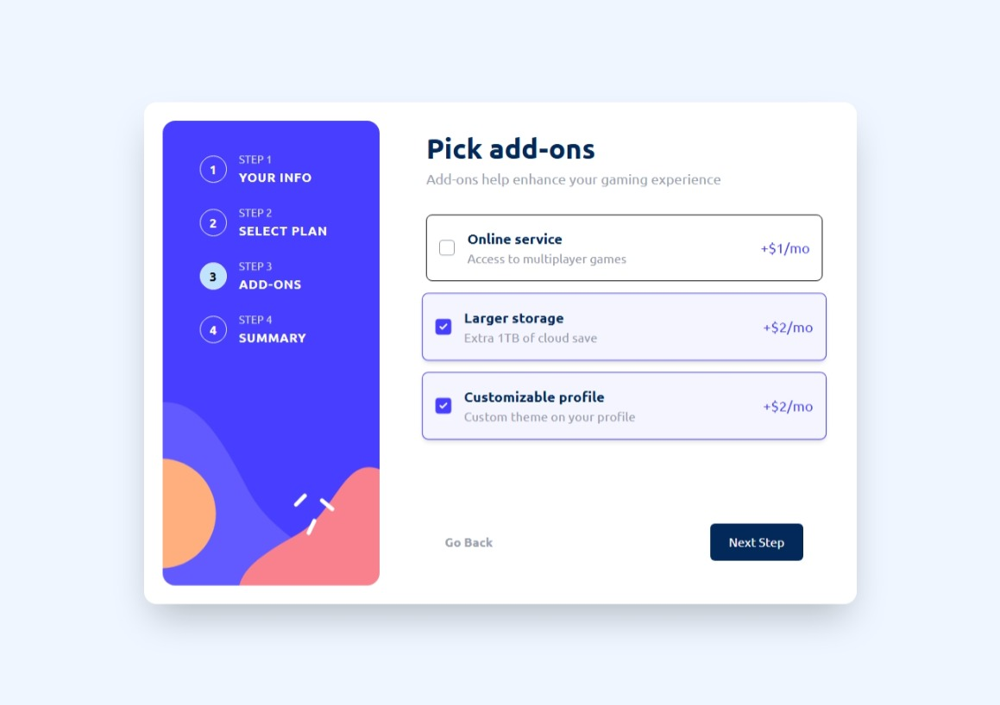
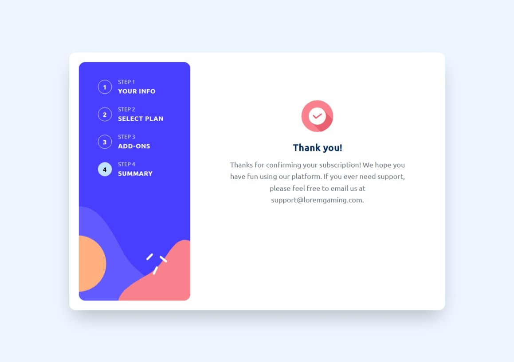
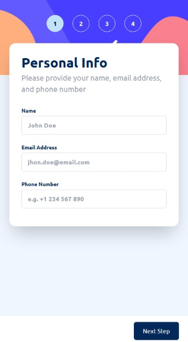
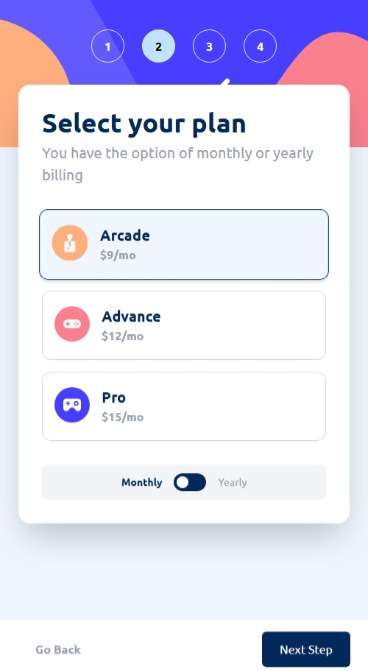
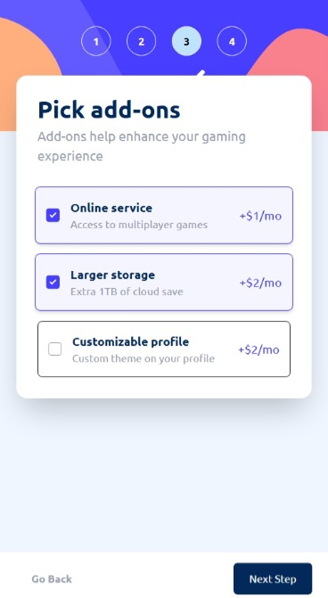
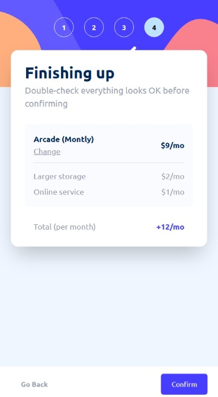

# Frontend Mentor - Multi-step form solution

This is a solution to the [Multi-step form challenge on Frontend Mentor](https://www.frontendmentor.io/challenges/multistep-form-YVAnSdqQBJ). Frontend Mentor challenges help you improve your coding skills by building realistic projects.

## Table of contents

- [Frontend Mentor - Multi-step form solution](#frontend-mentor---multi-step-form-solution)
  - [Table of contents](#table-of-contents)
  - [Overview](#overview)
    - [The challenge](#the-challenge)
    - [Screenshot](#screenshot)
      - [Desktop](#desktop)
      - [Mobile](#mobile)
    - [Links](#links)
  - [My process](#my-process)
    - [Built with](#built-with)
    - [What I learned](#what-i-learned)
    - [Continued development](#continued-development)
    - [Useful resources](#useful-resources)
  - [Author](#author)

## Overview

### The challenge

Users should be able to:

- Complete each step of the sequence
- Go back to a previous step to update their selections
- See a summary of their selections on the final step and confirm their order
- View the optimal layout for the interface depending on their device's screen size
- See hover and focus states for all interactive elements on the page
- Receive form validation messages if:
  - A field has been missed
  - The email address is not formatted correctly
  - A step is submitted, but no selection has been made

### Screenshot

#### Desktop

<div style="display: flex; flex-direction: row; gap:12px; flex-wrap:wrap">
  
  
  
  
  
</div>

#### Mobile

<div style="display: flex; flex-direction: row; gap:12px; flex-wrap:wrap">





</div>

### Links

- Solution URL: [Github](https://github.com/lenez12/multi-step-form-main-react.git)
- Live Site URL: [Live Demo](https://lenez-multistep.netlify.app/)

## My process

### Built with

- Semantic HTML5 markup
- CSS custom properties
- Flexbox
- CSS Grid
- Mobile-first workflow
- [React](https://reactjs.org/) - JS library
- [Tailwind](https://tailwindcss.com/docs/installation/using-vite) - For styles

### What I learned

Using React JS with vite, using tailwind 4 in vite. Create component using atomic design pattern

What I have learned is :

1.when using tailwind arbitrary class and have spacing you could using underscore instead space

```html
<div className="sm:grid-rows-[150px_50px_minmax(400px,_1fr)_70px]">
  Some HTML code I'm proud of
</div>
```

2.We can create component with custom styles on **@layer component** and alwo we can edit base on **@layer base** like below:

```css
@layer utilities {
  .bg-gradient-radial {
    background-image: radial-gradient(circle, var(--tw-gradient-stops));
  }

  .text-shadow {
    text-shadow: 1px 1px 2px rgba(0, 0, 0, 0.25);
  }
}

@layer components {
  .card {
    background-color: var(--color-white);
    border-radius: var(--rounded-lg);
    padding: var(--spacing-6);
    box-shadow: var(--shadow-xl);
  }

  .bg-sidebar {
    background-image: url("./assets/images/bg-sidebar-mobile.svg");
    background-repeat: no-repeat;
    background-size: cover;
    background-position: center center;
    width: 100%;
    object-fit: cover;
  }

  /* Responsive override for lg (Tailwind's lg = 1024px) */
  @media (min-width: 1024px) {
    .bg-sidebar {
      background-image: url("./assets/images/bg-sidebar-desktop.svg");
      background-size: cover;
      background-position: 25% 75%;
    }
  }

  .bg-indicator-circle {
    background-color: hsl(var(--color-light-blue));
  }
}

@layer base {
  h1 {
    @apply text-4xl font-bold;
  }

  body {
    @apply font-ubuntu;
  }
```

3.We can't using .module.css when using tailwind.
4.We can using **useImperativeHandle** so the parent could control the children directly using **ref**

```js
useImperativeHandle(ref, () => ({
  validateAndGetData: () => {
    const isNameValid = nameField.validate();
    const isEmailValid = emailField.validate();
    const isPhoneValid = phoneField.validate();

    const isValid = isNameValid && isEmailValid && isPhoneValid;

    return {
      isValid,
    };
  },
}));
```

### Continued development

In the future I will continue to learn about context api, reducer concept.
And I will update to using third-party router library like React router.
so each step can be track from browser.

Also I will be update the sidebar step hanling on context so it would be centralize.

### Useful resources

- [Atomic Design Methodology](https://atomicdesign.bradfrost.com/chapter-2/) - This helping to decided how to create component with readibility and reusefull
- [Use Imperative React js](https://react.dev/reference/react/useImperativeHandle) - This helping me to learn ho use imperative work so I can handle the navigation and validate the form from the parent.

## Author

- Website - [Jery Lenas](https://www.jeryl.id)
- Frontend Mentor - [@lenez12](https://www.frontendmentor.io/profile/lenez12)
